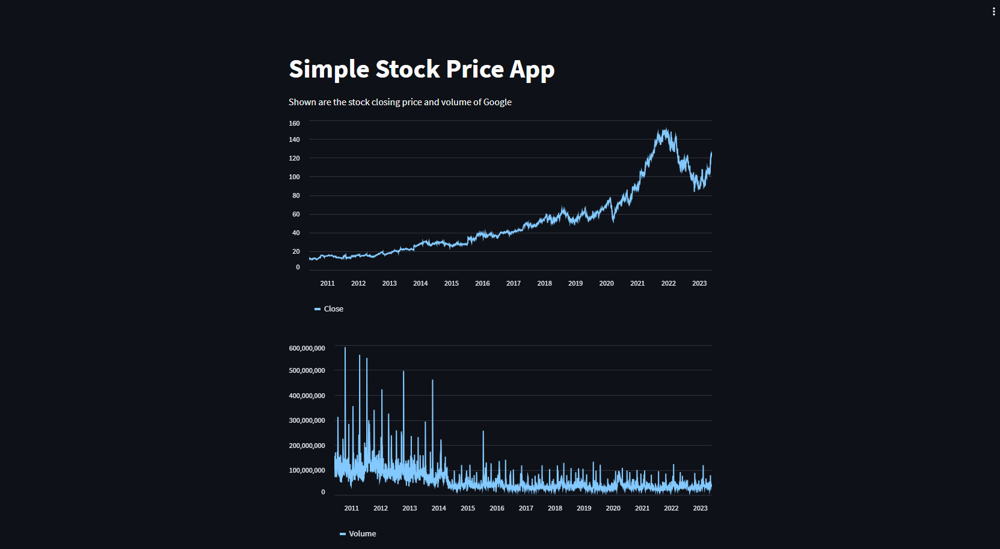

# Simple Stock Price

Data driven web app

Usaremos [Streamlit](https://streamlit.io/)

Se instala:

```bash
pip install streamlit
```

En el ejemplo también se necesita la librería ```yfinance```

Código que se usa:

```python
import yfinance as yf
import streamlit as st
import pandas as pd

st.write("""
# Simple Stock Price App

Shown are the stock closing price and volume of Google

""")

tickerSymbol = 'GOOGL' # Definir Ticker Symbol
tickerData = yf.Ticker(tickerSymbol) # Se obtienen sus datos
tickerDf = tickerData.history(period = '1d', start = '2010-5-31') # Obtenemos precios históricos del Ticker

st.line_chart(tickerDf.Close)
st.line_chart(tickerDf.Volume)
```

Abro una Anaconda Powershell Prompt en el perfil que tiene instalado Streamlit y me posiciono en el directorio donde está el código, solamente ejecuto:

```bash
streamlit run main.py
```

Resultado:

