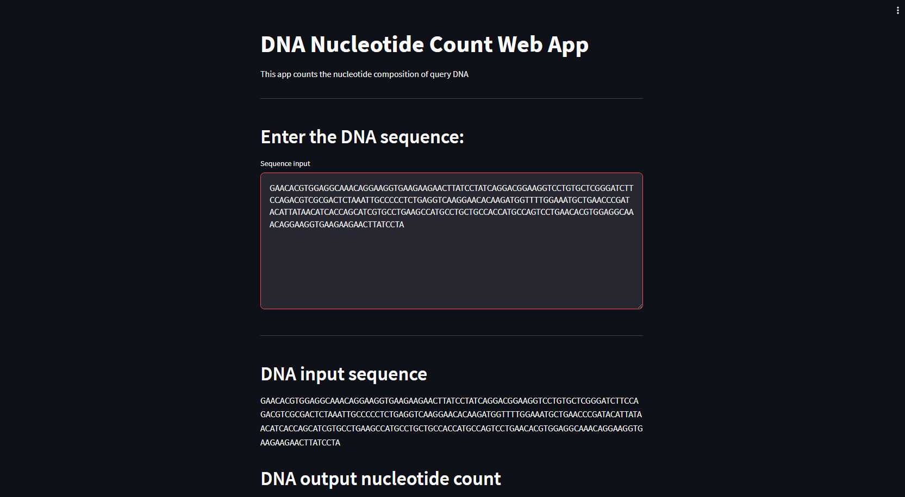
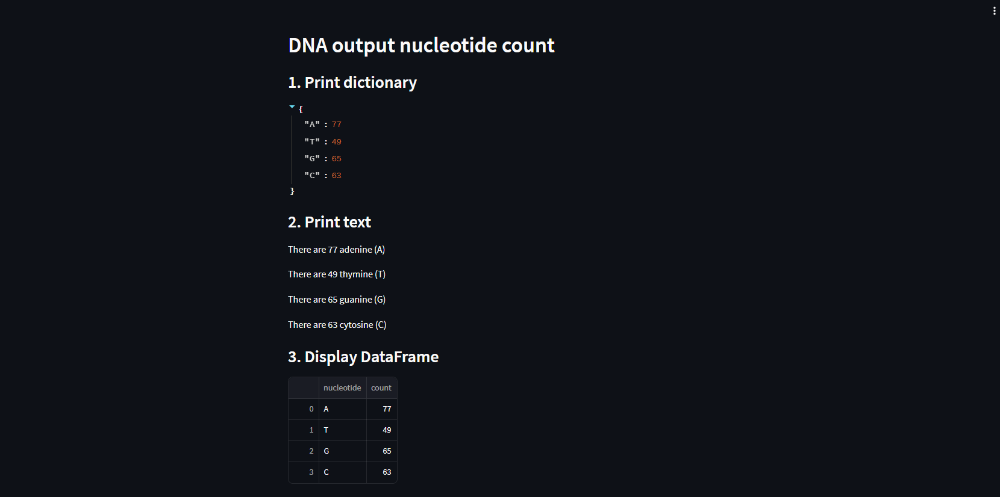

# Simple Bioinformatics DNA

Muy similar al anterior, el código es el siguiente:

```python
import pandas as pd
import streamlit as st
import altair as alt
from PIL import Image

image = Image.open('dna.png')
st.image(image, use_column_width = True)

st.write("""
# DNA Nucleotide Count Web App

This app counts the nucleotide composition of query DNA

---
""")

st.header('Enter the DNA sequence:')

sequence_input = "GAACACGTGGAGGCAAACAGGAAGGTGAAGAAGAACTTATCCTATCAGGACGGAAGGTCCTGTGCTCGGG\nATCTTCCAGACGTCGCGACTCTAAATTGCCCCCTCTGAGGTCAAGGAACACAAGATGGTTTTGGAAATGC\nTGAACCCGATACATTATAACATCACCAGCATCGTGCCTGAAGCCATGCCTGCTGCCACCATGCCAGTCCT"

sequence = st.text_area("Sequence input", sequence_input, height=250)
sequence = sequence.splitlines()
# sequence = sequence[1:] # Skips the sequence name (first line)
sequence = ''.join(sequence) # Concatenates list to string

st.write("""
---
""")

# Prints the input DNA sequence
st.header('DNA input sequence')
sequence

# DNA nucleotide count
st.header('DNA output nucleotide count')

# 1. Print dictionary
st.subheader('1. Print dictionary')

def DNA_nucleotide_count(seq):
  d = dict([('A',seq.count('A')),
            ('T',seq.count('T')),
            ('G',seq.count('G')),
            ('C',seq.count('C'))
            ])
  return d

X = DNA_nucleotide_count(sequence)

X

# 2. Print text
st.subheader('2. Print text')
st.write('There are  ' + str(X['A']) + ' adenine (A)')
st.write('There are  ' + str(X['T']) + ' thymine (T)')
st.write('There are  ' + str(X['G']) + ' guanine (G)')
st.write('There are  ' + str(X['C']) + ' cytosine (C)')

# 3. Display DataFrame
st.subheader('3. Display DataFrame')
df = pd.DataFrame.from_dict(X, orient='index')
df = df.rename({0: 'count'}, axis='columns')
df.reset_index(inplace=True)
df = df.rename(columns = {'index':'nucleotide'})
st.write(df)

# 4. Display Bar Chart using Altair
st.subheader('4. Display Bar chart')
p = alt.Chart(df).mark_bar().encode(
    x='nucleotide',
    y='count')

p = p.properties(width=alt.Step(80))  # Controls width of bar

st.write(p)
```

Resultados:





